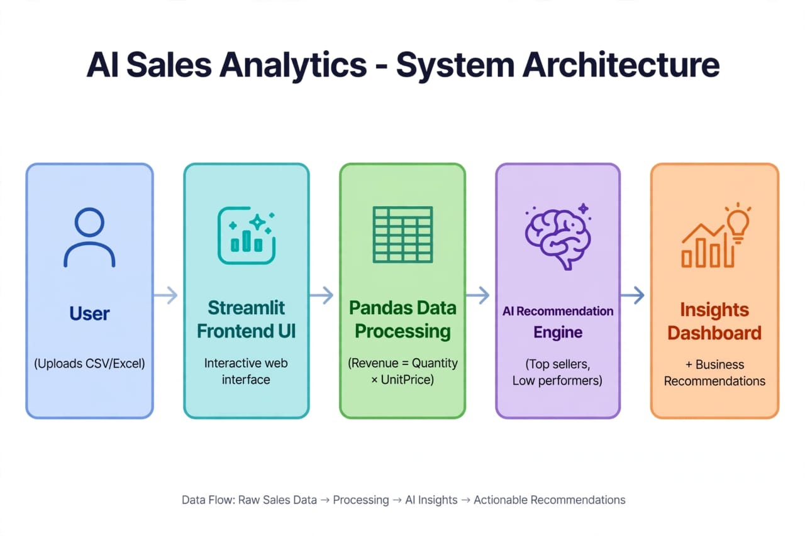

# ai-sales-revenue-analytics

AI-Powered Sales and Revenue Analytics Assistant that analyzes Online Retail data, calculates Revenue = Quantity * UnitPrice, identifies top-selling & low-performing products, and provides AI-driven business recommendations.

## Features
- Upload CSV and auto-calculate Revenue
- Total Revenue, Top Product, Monthly Trends
- Top 10 & Bottom 10 Products Charts
- AI Business Recommendations

## Tech Stack
Python, Pandas, Streamlit, Plotly

## Dataset Insights
- UK is 90% market
- Gift items and mugs are top sellers
- Revenue peaks in November

## System Architecture

## How to Run
pip install -r requirements.txt
streamlit run app.py

## Future Scope
Add OpenAI integration for natural language queries and Power BI dashboard.

Built by Nagyari Manasa | B.Tech ECE Final Year
